  

**Building useful software — from application interfaces to the systems behind them.**

[Selected projects](#selected-projects) · [Engineering focus](#engineering-focus) · [Current work](#current-work) · [Tech stack](#tech-stack)

 

## About me

I'm **Lafry**, a **Software Engineer** interested in building practical web applications and connected systems. During my backend development internship, I contribute to an **AI customer support chatbot**, working on authentication, session management, user and business APIs, and knowledge base improvements.

I work with **Java / Spring Boot** and **Node.js / TypeScript**, with projects spanning business platforms, web applications, and mobile backends. I enjoy understanding how the pieces connect and making them easier to maintain.

## Selected projects

| Project | What it explores | Core stack | Explore |
| :--- | :--- | :--- | :---: |
| **B2B Wholesale Platform** | Business registration, **inventory and order workflows**, invoicing, payments, and requests for quotation. | `Java 17` · `Spring Boot` · `JPA` · `MySQL` | [API ↗](https://github.com/lafryAhmd/B2B-Wholesale-Management-System-Backend) · [UI ↗](https://github.com/lafryAhmd/B2B-Wholesale-Management-System-Frontend) |
| **Neighborhood Resource Sharing** | Community borrowing and lending with **real-time messaging**, request lifecycle tracking, and role-based access. | `Node.js` · `Express` · `MongoDB` · `Socket.IO` · `React Native` | [Code ↗](https://github.com/lafryAhmd/Neighborhood-Resource-Sharing-System) |
| **Insurance Management** | A full-stack application connecting **policy, claims, and user management** through a Spring Boot backend and React frontend. | `Java` · `Spring Boot` · `React` | [Code ↗](https://github.com/lafryAhmd/Web-based-Insurance-Management-System) |
| **Fraud Detection Pipeline** | Group coursework covering **data preprocessing, class imbalance**, model training, and evaluation. | `Python` · `Jupyter` · `scikit-learn` | [Code ↗](https://github.com/lafryAhmd/AI-ML-pipeline) |
| **Bike Rental & Ride Sharing** | Rental requests, bike assignment, and ride management using **object-oriented design** and file-based storage. | `Java` · `Spring Boot` · `Thymeleaf` | [Code ↗](https://github.com/lafryAhmd/Bike-Rental-and-Ride-Sharing-Platform) |

## Engineering focus

- **Authentication & sessions** — Login and recovery flows, short-lived access tokens, refresh token rotation, and session revocation.
- **Business APIs** — Connecting profiles, permissions, and application workflows through backend services.
- **Data & application structure** — Working with relational and document databases across Java and Node.js projects.
- **Team development** — Reviewing code, resolving integration issues, and improving shared modules through Git and pull requests.

## Current work

**AI Customer Support Chatbot · Backend internship**

Contributing to a team project across authentication, profile management, and the knowledge base.

| Area | My work |
| :--- | :--- |
| **Authentication** | Login, refresh, logout, and password recovery flows. |
| **Session security** | Refresh token rotation, session visibility and revocation, and authentication rate limiting. |
| **User & business APIs** | Profile retrieval and updates, password changes, and business settings. |
| **Knowledge base** | Reviewing existing work, fixing errors, and developing module improvements. |

## Tech stack

  
  
  
  

<b>Explore frameworks, databases & tools</b>

 

**Backend & authentication**

**Databases & persistence**

**Web & mobile projects**

**Development & collaboration**

 

---

<b>Understand the problem. Build the system. Keep improving.</b>

